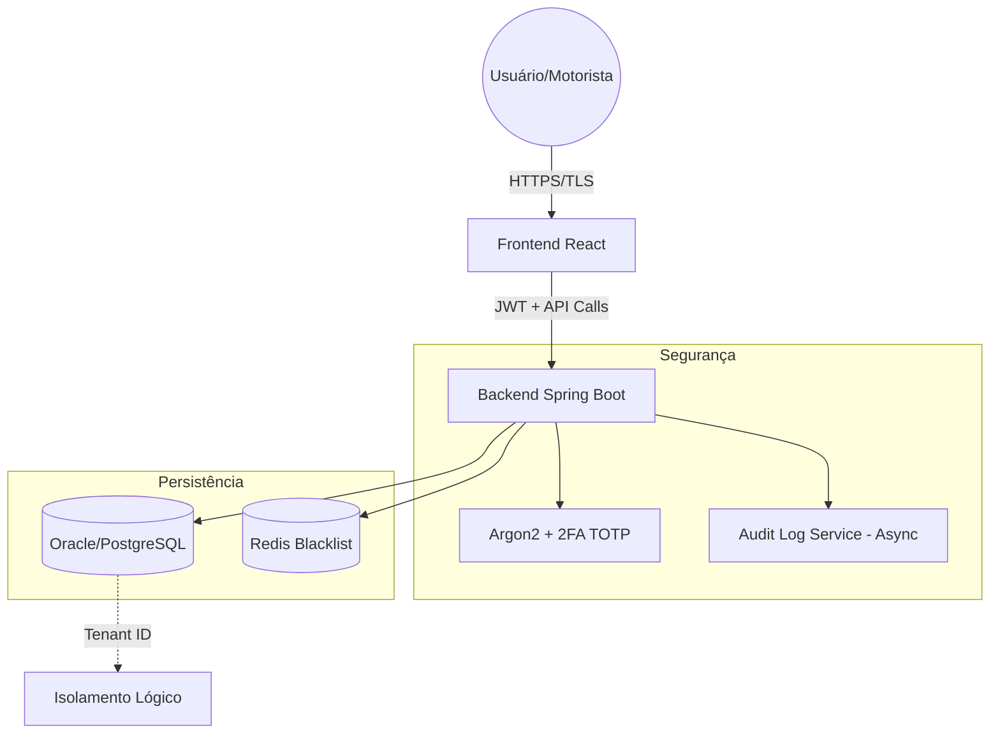
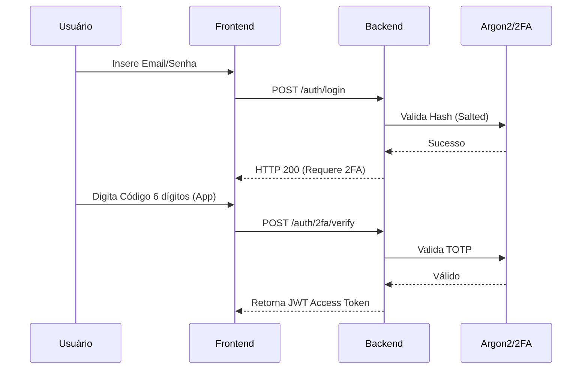
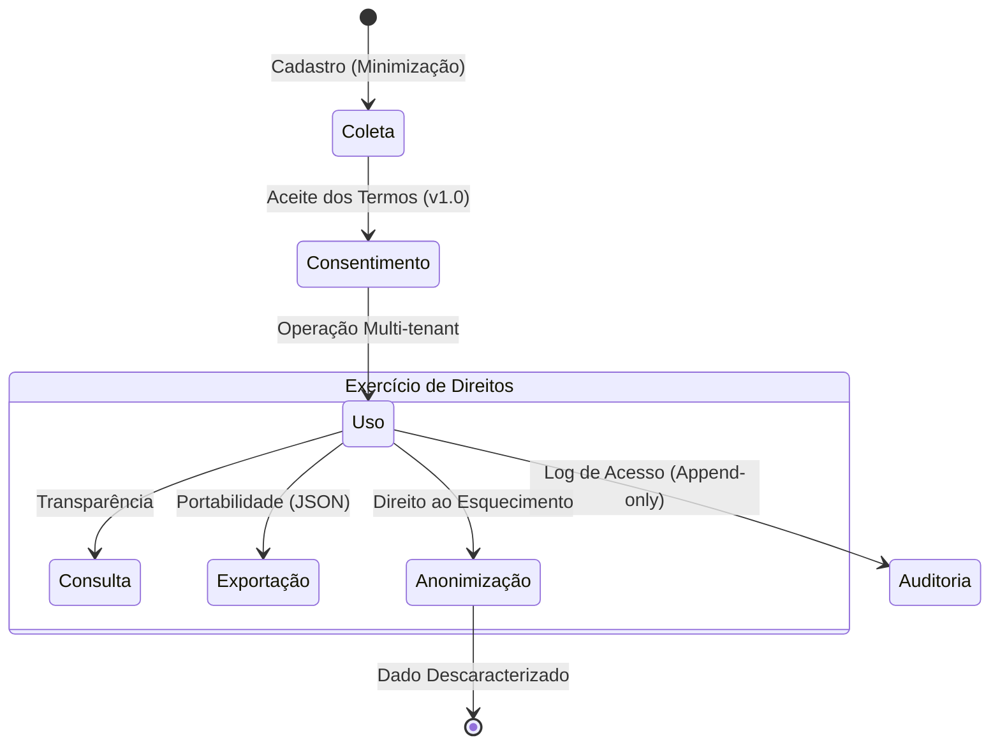

# Planejamento do Infográfico Científico - Projeto Dumply

Este documento contém o roteiro, conteúdo e diagramas para a criação do infográfico (pôster científico) do projeto Dumply, atendendo aos requisitos da **Etapa 8**.

---

## 1. Estrutura do Infográfico

O infográfico deve ser organizado nas seguintes seções:

1.  **Título e Identificação:** Dumply - Gestão Segura de Ativos e Conformidade LGPD.
2.  **Objetivo:** Apresentar uma solução multi-tenant para gestão de equipamentos com foco em segurança da informação e privacidade.
3.  **Arquitetura do Sistema:** Visão macro dos componentes e tecnologias.
4.  **Mecanismos de Segurança:** Detalhamento da proteção de credenciais, 2FA e auditoria.
5.  **Ecossistema LGPD:** Como a lei é aplicada na prática (Consentimento, Direitos, Minimização).
6.  **Conclusão e Referências.**

---

## 2. Conteúdo das Seções

### 2.1 Objetivo (Resumo Científico)
O Dumply foi desenvolvido para resolver o desafio de gerir ativos empresariais garantindo a privacidade dos dados pessoais dos operadores. Utiliza o paradigma *Privacy by Design*, incorporando controles de segurança desde a modelagem do banco de dados até a interface do usuário.

### 2.2 Arquitetura Técnica
*   **Backend:** Java 17, Spring Boot 3.4, Spring Security.
*   **Frontend:** React (Vite), Tailwind CSS.
*   **Banco de Dados:** Oracle Database / PostgreSQL (compatibilidade multi-banco).
*   **Segurança:** JWT para sessões, Redis para blacklist de tokens.
*   **Isolamento:** Arquitetura Multi-tenant (Logical Isolation) garantindo que uma empresa nunca acesse dados de outra.

### 2.3 Pilares de Segurança
*   **Gestão de Credenciais:** Uso de Argon2/BCrypt com salt único por usuário.
*   **MFA (Multi-Factor Authentication):** Implementação de TOTP (Time-based One-Time Password) via Google Authenticator.
*   **Proteção de Força Bruta:** Bloqueio temporário após 5 tentativas falhas.
*   **Auditoria Imutável:** Registro assíncrono de eventos críticos em tabela *append-only*.

### 2.4 Conformidade LGPD (Destaque do Projeto)
*   **Minimização:** Coleta apenas de E-mail, Nome e Documento.
*   **Consentimento Granular:** O usuário escolhe quais finalidades aceita (Marketing vs. Essencial).
*   **Direitos do Titular:**
    *   **Consulta:** Visualização transparente dos dados.
    *   **Portabilidade:** Exportação em formato JSON interoperável.
    *   **Anonimização:** Exclusão de conta que preserva integridade histórica sem identificar a pessoa natural.

---

## 3. Diagramas para o Infográfico

### 3.1 Diagrama de Arquitetura (Mermaid)

### 3.2 Fluxo de Autenticação Segura

### 3.3 Ciclo de Vida do Dado (LGPD)

---

## 4. Evidências para o Pôster

Para cumprir o item **8.3 (Evidência de conformidade)**, sugere-se incluir no pôster prints das seguintes telas/funcionalidades:
1.  **Tela de 2FA:** QR Code e campo de verificação.
2.  **Dashboard LGPD:** Onde o usuário vê seus dados e o botão de exportar/excluir.
3.  **Logs de Auditoria:** Visualização dos eventos registrados.

---

## 5. Referências Sugeridas
*   BRASIL. Lei nº 13.709, de 14 de agosto de 2018. Lei Geral de Proteção de Dados Pessoais (LGPD).
*   CAVOUKIAN, Ann. Privacy by Design: The 7 Foundational Principles. 2011.
*   OWASP Top 10:2021. The Standard Awareness Document for Developers.
